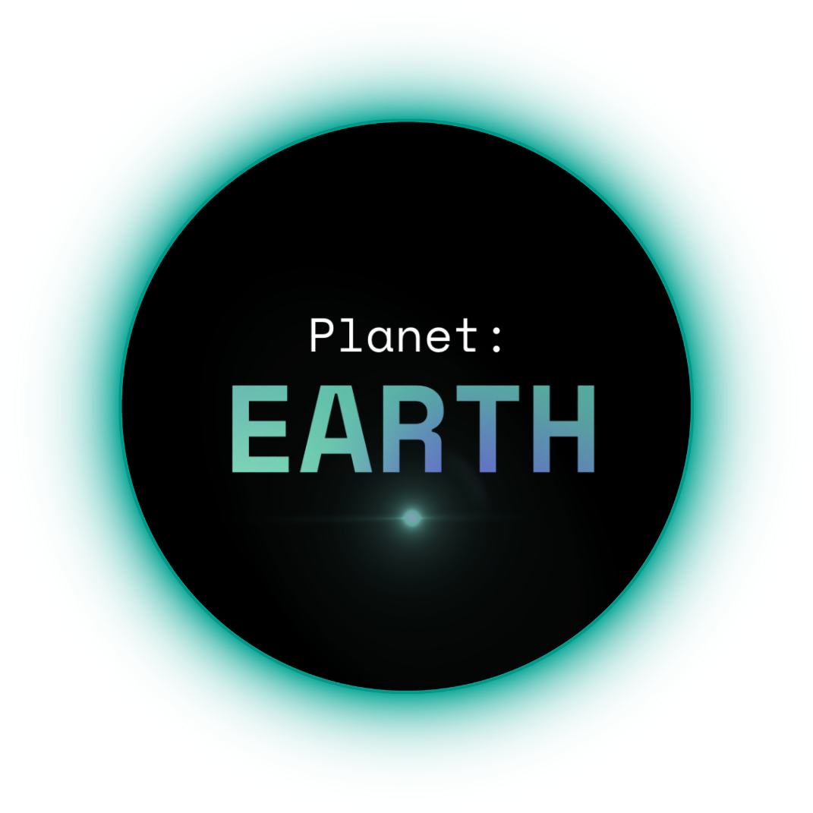
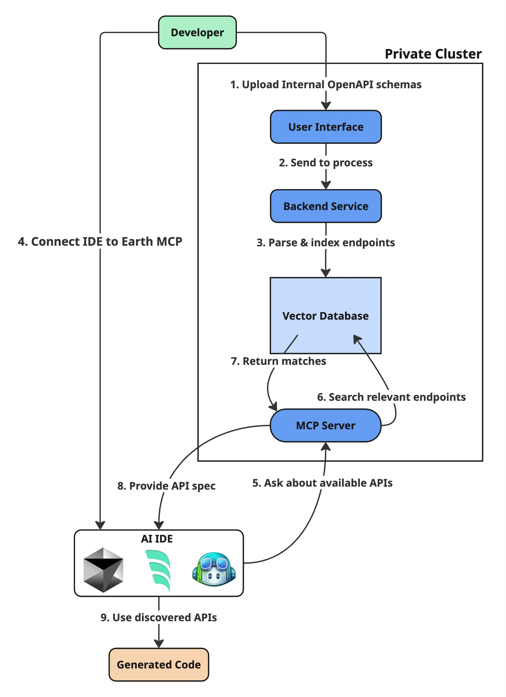

<div align="center">

<picture>
  <source srcset="assets/planet-logo.png" media="(prefers-color-scheme: dark)" alt="Planet Earth Logo">
  
</picture>

**Unlocking your internal APIs for AI — The missing bridge that transforms how AI tools discover and interact with your organization's hidden service ecosystem.**

[](https://github.com/uriafranko/planet-earth/stargazers)
[](https://github.com/uriafranko/planet-earth/blob/main/LICENSE)
</div>

## 🚀 Overview

Planet Earth is an open-source platform that bridges the gap between modern AI-powered development environments and your internal services. By indexing and vectorizing your internal OpenAPI schemas, Planet Earth enables AI IDEs to discover and utilize your private APIs - something traditional AI assistants can't do without specific context about your internal systems.

## ✨ Features

- **API Discovery**: Index and search internal OpenAPI schemas through vector embeddings
- **AI IDE Integration**: Seamlessly connect AI-powered IDEs with your internal services
- **MCP Server**: Expose a Machine Code Protocol server that AI tools can leverage
- **Self-Hosted**: Deploy on your own infrastructure, keeping sensitive API data secure
- **Scalable Architecture**: Built with FastAPI, Celery, React, Postgres with pgvector, and Bun for scalable MCP (Optional)
- **Helm Support**: Easy Kubernetes deployment with included Helm charts
- **BYO Infrastructure**: Bring your own Postgres or Redis instances if desired

## 📋 Table of Contents

- [🚀 Overview](#-overview)
- [✨ Features](#-features)
- [📋 Table of Contents](#-table-of-contents)
- [🏗️ System Architecture](#️-system-architecture)
  - [Flow Diagram](#flow-diagram)
- [🔧 Installation](#-installation)
  - [Prerequisites](#prerequisites)
  - [Quick Start with Docker Compose](#quick-start-with-docker-compose)
  - [Kubernetes Deployment with Helm](#kubernetes-deployment-with-helm)
- [🚀 Usage](#-usage)
  - [Uploading OpenAPI / Postman Schemas](#uploading-openapi--postman-schemas)
  - [Connecting to an AI IDE](#connecting-to-an-ai-ide)
  - [Using the APIs in your IDE](#using-the-apis-in-your-ide)
- [📁 Project Structure](#-project-structure)
- [💻 Development](#-development)
  - [Setting Up Development Environment](#setting-up-development-environment)
  - [Running Tests](#running-tests)
- [👥 Contributing](#-contributing)
- [📜 License](#-license)
- [🌐 Community](#-community)

## 🏗️ System Architecture

Planet Earth follows a modern, microservices-based architecture:

### Flow Diagram




The system works as follows:

1. User deploys Planet Earth to their cluster
2. User uploads internal OpenAPI / Postman schemas to their Planet Earth instance
3. Planet Earth parses the schemas and breaks them into endpoints
4. These endpoints are embedded and saved into a vector search database (PostgreSQL with pgvector)
5. Planet Earth exposes an MCP server
6. Users add this MCP to their AI-powered IDE
7. The IDE can now discover and utilize internal APIs through the MCP

## 🔧 Installation

### Prerequisites

- Docker and Docker Compose
- Kubernetes cluster (for production deployments)
- Helm (for Kubernetes deployments)

### Quick Start with Docker Compose

```bash
# Clone the repository
git clone https://github.com/uriafranko/planet-earth.git
cd planet-earth/earth-service

# Create .env file (copy from example)
cp .env.example .env

# Start all services
docker-compose up -d
```

### Kubernetes Deployment with Helm

```bash
# Add the Planet Earth Helm repository
helm repo add planet-earth https://your-username.github.io/planet-earth/charts

# Update repositories
helm repo update

# Install Planet Earth
helm install planet-earth planet-earth/earth-chart \
  --namespace planet-earth \
  --create-namespace \
  --values your-values.yaml
```

## 🚀 Usage

### Uploading OpenAPI / Postman Schemas

1. Access the Planet Earth web interface at `http://localhost:3000` (or your custom domain)
2. Navigate to the "Schemas" section
3. Upload your OpenAPI / Postman JSON or YAML files
4. Planet Earth will automatically process and index the schemas

### Connecting to an AI IDE

1. In your Planet Earth dashboard, go to "MCP Settings"
2. Copy your MCP endpoint URL and API key
3. Configure your AI IDE to use the Planet Earth MCP:
   - For Cursor: Settings > AI > Custom Tools > Add MCP Server
   - For other IDEs: Follow your IDE's documentation for MCP/custom tool integration

### Using the APIs in your IDE

Once connected, your AI IDE will be able to discover and use your internal APIs during code generation and assistance. Simply describe what you're trying to do, and the AI will suggest the appropriate internal API calls.

## 📁 Project Structure

```
planet-earth/
├── earth-service/        # FastAPI backend + Celery workers
│   ├── app/              # Application code
│   ├── tests/            # Backend tests
│   ├── Dockerfile        # Backend Docker image
│   └── compose.yaml      # Docker compose configuration
│
├── earth-frontend/       # React frontend
│   ├── src/              # Frontend source code
│   ├── public/           # Static assets
│
├── earth-mcp/            # Scalable MCP server (Bun)
│   ├── index.ts              # MCP server code
│   └── Dockerfile        # MCP Docker image
│
├── earth-chart/          # Helm charts for Kubernetes deployment
│   ├── templates/        # Kubernetes manifest templates
│   └── values.yaml       # Default configuration values
│
├── docs/                 # Documentation
│   ├── getting-started/  # Getting started guides
│   └── api/              # API documentation
│
├── scripts/              # Utility scripts
├── .github/              # GitHub workflows and templates
└── README.md             # This file
```

## 💻 Development

### Setting Up Development Environment

```bash
# Clone the repository
git clone https://github.com/uriafranko/planet-earth.git
cd planet-earth

# Backend development
cd earth-service
make install
pre-commit install

# Frontend development
cd ../earth-frontend
npm install

# Start development servers
cd ../earth-service
docker-compose -f compose.yaml up
```

### Running Tests

```bash
# Backend tests
cd earth-service
pytest

# Frontend tests
cd ../earth-frontend
npm test
```

## 👥 Contributing

We love contributions! Please see our [Contributing Guide](CONTRIBUTING.md) for details on how to get started.


## 📜 License

This project is licensed under the MIT License - see the [LICENSE](LICENSE) file for details.

## 🌐 Community

<!-- - [Discord](https://discord.gg/your-discord-invite) - Join our community chat -->
- [GitHub Discussions](https://github.com/uriafranko/planet-earth/discussions) - For questions and discussions
<!-- - [Twitter](https://twitter.com/your-twitter-handle) - Follow us for updates -->

---

<div align="center">
  <sub>Built with ❤️ by the Planet team</sub>
</div>
