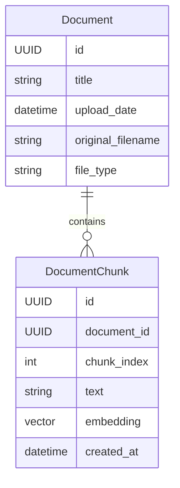
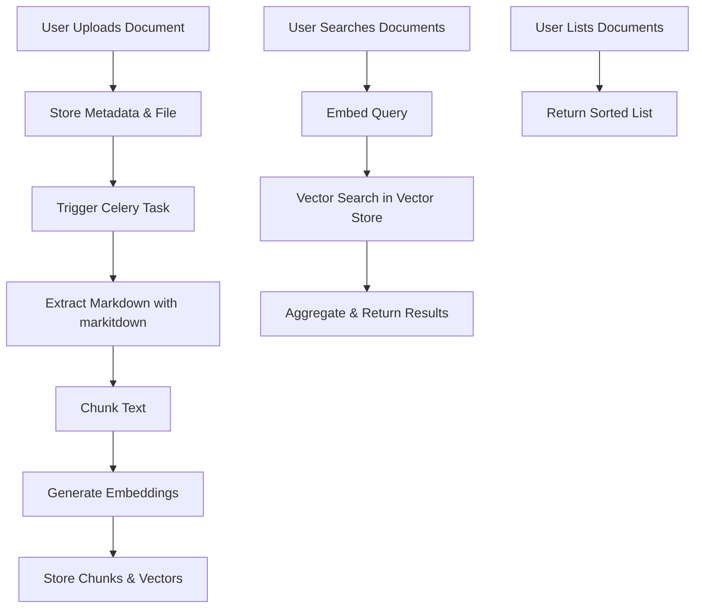

# Document Upload, Embedding, and Search System

## Tech Stack

- **Backend Framework:** FastAPI
- **ORM:** SQLModel (with PostgreSQL)
- **Vector Store:** PostgreSQL with pgvector extension
- **Embedding Model:** Open-source (e.g., Sentence Transformers, MiniLM, or similar)
- **Text Extraction:** [markitdown](https://github.com/microsoft/markitdown) for PDF/DOCX/Markdown conversion
- **Task Queue:** Celery (for background processing)
- **File Parsing:** markitdown, python-docx, pdfminer.six (as needed)
- **Testing:** pytest

---

## Data Model

### Document

| Field             | Type      | Description                        |
|-------------------|-----------|------------------------------------|
| id                | UUID      | Primary key                        |
| title             | str       | Document title                     |
| upload_date       | datetime  | Upload timestamp                   |
| original_filename | str       | Name of uploaded file              |
| file_type         | enum      | plain, pdf, docx                   |
| chunks            | relation  | List of DocumentChunk              |

### DocumentChunk

| Field        | Type      | Description                        |
|--------------|-----------|------------------------------------|
| id           | UUID      | Primary key                        |
| document_id  | UUID      | Foreign key to Document            |
| chunk_index  | int       | Order of chunk in document         |
| text         | str       | Chunk text                         |
| embedding    | vector    | Embedding (or reference to vector) |
| created_at   | datetime  | Creation timestamp                 |

---

## Workflow

### 1. Upload

- **Endpoint:** `POST /documents/upload`
- **Accepts:** title, file (plain text, PDF, DOCX)
- **Process:**
  1. Store metadata and file.
  2. Trigger a Celery background task to:
     - Extract markdown from file using markitdown.
     - Chunk the markdown text (see chunking strategy below).
     - Generate embeddings for each chunk using an open-source model.
     - Store DocumentChunk records and vectors in the vector store.

### 2. Search

- **Endpoint:** `POST /documents/search`
- **Accepts:** query (text), filters (title, upload_date), top_k
- **Process:**
  1. Embed the query.
  2. Perform vector search over DocumentChunk embeddings.
  3. Aggregate and return matching documents.

### 3. List Documents

- **Endpoint:** `GET /documents/`
- **Returns:** List of all documents, sorted by upload date (descending).

---

## Text Chunking

### Chunking Strategy

- **Markdown Extraction:** Use markitdown to convert uploaded files (PDF, DOCX, etc.) to markdown.
- **Tokenization:** Use a tokenizer compatible with the embedding model (e.g., HuggingFace's `AutoTokenizer` for MiniLM or similar).
- **Chunk Size:** Each chunk will contain a fixed number of tokens (e.g., 512 tokens per chunk).
- **Overlap:** Use a sliding window with overlap (e.g., 20% overlap, so each chunk shares 102 tokens with the previous one).
- **Chunk Boundaries:** Prefer to break at sentence or paragraph boundaries when possible, but default to token count if necessary.

#### Chunking Pseudocode

```
1. Extract markdown text from file.
2. Tokenize the text.
3. For i in range(0, len(tokens), chunk_size - overlap):
      chunk_tokens = tokens[i : i + chunk_size]
      chunk_text = detokenize(chunk_tokens)
      store chunk_text as a DocumentChunk
```

- **Why This Approach?**
  - Consistent Embedding Input: Ensures each chunk fits within the embedding model's max input size.
  - Context Preservation: Overlap allows for better semantic continuity across chunks.
  - Efficient Search: Each chunk is independently searchable, improving recall for long documents.

- **Implementation Notes:**
  - The chunking logic will be implemented in a dedicated service (e.g., `TextChunker`).
  - The chunking and embedding process will run in a Celery background task after upload.
  - Chunk size and overlap can be tuned for optimal retrieval performance.

---

## Background Processing

- All heavy processing (extraction, chunking, embedding, vector storage) is handled by a Celery task.
- The upload endpoint returns immediately with a document ID and status.
- Document status can be polled or updated via a status field (e.g., pending, processing, ready, failed).

---

## Mermaid Diagrams

### Entity Relationship



### Workflow



---

## Open Source Only

- All components (embedding, extraction, storage) use open-source libraries and models.
- No external API keys or paid services required.

---

## API Summary

| Endpoint                | Method | Description                                 |
|-------------------------|--------|---------------------------------------------|
| /documents/upload       | POST   | Upload a new document                       |
| /documents/search       | POST   | Semantic search over documents              |
| /documents/             | GET    | List all documents, sorted by upload date   |
